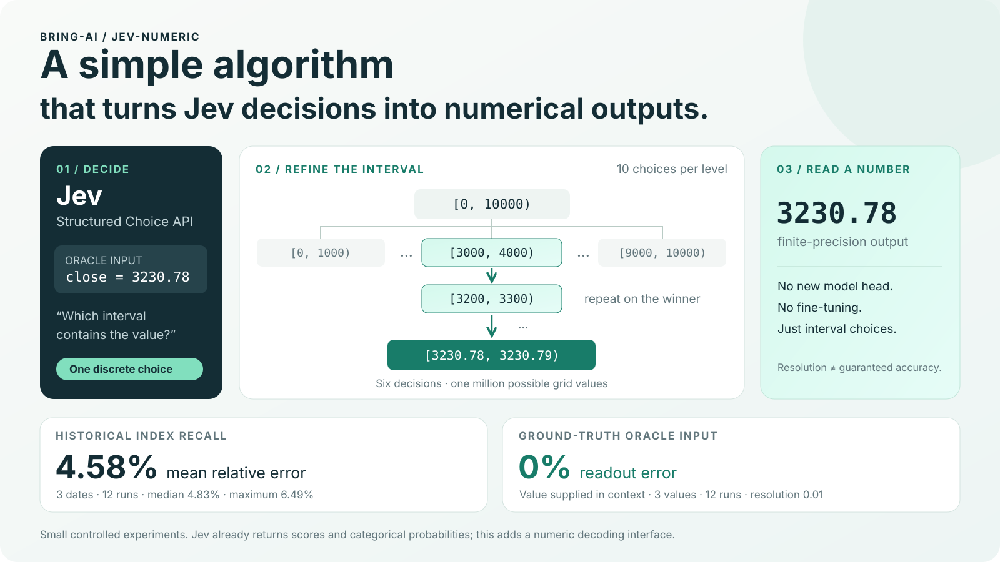
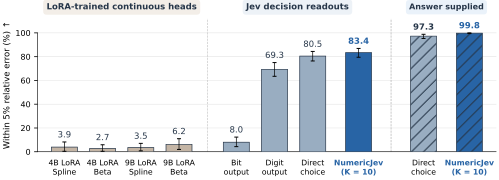

# A simple algorithm that turns Jev decisions into accurate numerical outputs

<p align="center">
  <a href="https://bring-ai.github.io/jev-numeric/"></a>
  <a href="https://github.com/Bring-AI/jev-numeric/stargazers"></a>
</p>

<p align="center"></p>

<p align="center"><strong>一个简单算法，把 Jev 的离散决策变成数值输出。</strong></p>
<p align="center"><a href="README.md">English</a> · <a href="#实测结果">实测结果</a> · <a href="#快速开始">快速开始</a> · <a href="artifacts/metrics.json">可核对的指标</a></p>

**Jev 擅长结构化决策。我们利用这种能力，加上多叉数值决策树，构建一个可指定范围与精度的数值输出接口。** 每次只问“答案落在哪个区间”，再在选中的区间中继续细分。不训练模型，也不添加回归头。

## 增加了什么能力？

| 能力 | Jev<br>Decision-only（官方） | Jev-numeric（本方法） |
|---|:---:|:---:|
| 决策与选项概率 | ✅ | ✅ |
| 等级评分 | ✅ | ✅ |
| 数值解码 | ❌ | ✅ |
| CDF / 直方图构造 | ❌ | ✅* |

原生接口：[Choice](https://docs.typesafe.ai/primitives/choice)、[Score](https://docs.typesafe.ai/primitives/score)。*实验性，尚未验证概率校准。

## 甚至优于从包含正确答案的列表中直接选择

<p align="center">
  
</p>

256 道算术题中，相对误差不超过 5% 的比例：**83.40% vs. 80.47%（提高 2.93 个百分点）**，直接选择的候选列表已包含正确答案。

<sub>误差线为 95% 题目族自助法区间。LoRA 连续头是在因果分布上训练、使用不同骨干模型的迁移基线；斜线柱为输入中提供答案的对照。</sub>

## 应用示例：Token 费用计算

给定计费规则和输入 token 数量，让 Jev 计算这次请求的费用。普通费率：**每百万输入 token 收费 $2**。

| 输入 token | 精确费用（$） | Jev 正序／倒序（$） | 相对误差 |
|---:|---:|---:|---:|
| 1,000 | 0.002000 | 0.002000 / 0.002000 | 0% |
| 12,345 | 0.024690 | 0.024690 / 0.024690 | 0% |
| 123,456 | 0.246912 | 0.246900 / 0.246910 | 0.00081%–0.00486% |
| 987,654 | 1.975308 | 1.975200 / 1.975200 | 0.00547% |

<sub>自定义费率的实际调用，仅计算输入费用，未向模型提供正确答案。正序／倒序指选项顺序；每个结果使用七次十叉决策，分辨率为 $0.000001。[完整结果，含分段计费和缓存折扣](artifacts/token-billing-20260923/summary.json)。</sub>

## 应用示例：连续游戏控制

**[查看完整视频和全部 69 次尝试 →](https://bring-ai.github.io/jev-numeric/)**

| 游戏 | 数值控制 | 展示实例的结果 |
|---|---|---|
| CarRacing 赛车 | 转向 + 带符号的油门/刹车 | **100% 覆盖赛道**，84.12 秒；四种 K / 精度设置均完成 |
| LunarLander 登月 | 主引擎 + 侧向引擎 | **安全着陆**，得分 243.91 |
| MountainCar 山地车 | 电机推力 | **两个种子都到达目标** |
| BipedalWalker 双足行走 | 四个关节控制量 | **走完全程**，得分 315.16 |

### CarRacing 赛车

https://github.com/user-attachments/assets/e88496d5-c280-4dbe-8503-916486268f8e

### LunarLander 登月

https://github.com/user-attachments/assets/c05a2498-43be-4739-8600-c1a3cf7666bf

### MountainCar 山地车

https://github.com/user-attachments/assets/bd18b739-557c-4048-b5d9-84a7385246ec

### BipedalWalker 双足行走

https://github.com/user-attachments/assets/b61fb921-8549-4cf5-8bd1-71c62d175b44

模型接收结构化状态和明确的控制指导，实际电机控制量由 NumericJev 解码产生，无训练、无备用控制器。展示录像选自提示词与控制规则调试后的真实运行，之前的失败记录全部保留。视频省略 API 等待。

区间比较版 Walker 的 2 条调试轨迹中，1 条走完全程；API 中断的轨迹通过精确重放已有记录后续跑。固定反馈规则被编译成输入区间，由 Jev 选择每个数值分项，再由程序明确地加总、限幅为关节指令。[Walker 协议和核验记录](docs/evidence/control/walker-redesign-REPORT.md)。

| 赛车，种子 7 · 修改后的提示词 | 精度 0.020 | 精度 0.005 |
|---|---:|---:|
| K=10 | **100%，84.54 秒** | **100%，84.06 秒** |
| K=20 | **100%，85.44 秒** | **100%，84.12 秒** |

<sub>相同修改后的提示词、正序选项、180 秒模拟时限，每种设置一次。K=20 / 0.005 还在种子 19 上以 93.78 秒完成。K=10 / 0.005 需要三层动作细分，其余为两层。登月 v14 在两个种子及各一次重复中均安全终止且得分超过 200。这些调试结果不代表一般成功率。[提示词修改、延迟和完整记录](docs/experiment-notes.md)。</sub>

## Turning Jev to Numerical Output

| 输入问题 | 数值输出 |
|---|---:|
| **1 + 1 等于多少？** | **`2.00`** |
| **一只股票现在 10 美元，上涨 1 美元后，价格是多少？** | **`11.00`** |
| **一只股票现在 10.50 美元，上涨 1.25 美元后，价格是多少？** | **`11.75`** |

以上是**实际调用结果**，不是预设的期望答案。测试使用英文问题，表中为中文翻译。三个例子统一在 `[0,100)` 上十叉细分，分辨率 `0.01`，每题四次 Choice 调用。**输入只包含题目，没有提供答案。** Jev 负责选择区间，JSON 接口直接返回数值。

**JSON 输入**

```json
{
  "model": "typesafe/jev-1.13-20260917",
  "state": "A stock costs USD 10. It rises by USD 1.",
  "questions": {
    "new_price": {
      "type": "number",
      "instructions": "What is the new stock price in USD?",
      "range": [0, 100],
      "resolution": 0.01
    }
  }
}
```

**JSON 输出——实测返回**

```json
{
  "model": "typesafe/jev-1.13-20260917",
  "answers": {
    "new_price": {
      "type": "number",
      "value": 11.0
    }
  }
}
```

```bash
jev-numeric --request examples/stock-price.json
```

`number` 是本项目增加的本地类型；底层仍调用 Jev Choice。[JSON 接口说明](docs/json-api.md) · [本次实测记录](artifacts/json-api-usd-20260923T091856Z/stock-price.json) · [三个例子的记录](artifacts/readme-examples-20260923T091853Z/results.json)。

## 方法：划分、选择、再细分

给定范围 `[L,U)`、分辨率 `ε` 和每层分支数 `K`：

1. 把当前区间分成最多 `K` 个互不重叠的子区间。
2. 用一次 Jev Choice 调用选择包含目标值的区间。
3. 沿该分支继续细分，直到只剩一个网格单元。
4. 返回最终区间，并用下端点作为数值读出。

真实值在上下文中给定为 `3230.78` 时，记录到的十叉路径为：

```text
[0,10000) → [3000,4000) → [3200,3300) → [3230,3240)
           → [3230,3231) → [3230.7,3230.8) → [3230.78,3230.79)
```

**六次离散选择，可以区分一百万个网格值。** 对 `N=(U−L)/ε` 个网格单元，最多需要 `ceil(log_K N)` 轮顺序决策。这个公式描述表示能力，不保证模型选对分支。

实现用整数网格索引和 Decimal 边界，支持非均匀大小的分支划分。默认每层十个选项。需要事先确定范围和精度；选错早期分支后，本实现不能回退。**最终小区间表示输出分辨率，并不是置信区间。**

## 实测结果

主体实验使用 OpenRouter 上的 `typesafe/jev-1.13-20260917`，没有微调，没有给模型检索工具。这是探索性的小规模实验；重复调用不等于新增独立样本。

### 股票指数历史回忆：平均相对误差 4.58%

问题明确为：标普 500 **价格指数在该年最后一个交易日的官方收盘点位**。只给日期和指数名，不给真实点位。统一从 `[0,10000)` 开始十叉细分，直到 `0.01` 点。两种选项顺序，各重复两次。

| 日期 | 真实点位 | 四次输出范围 | 绝对相对误差 |
|---|---:|---:|---:|
| 2019-12-31 | 3230.78 | 3331.10～3391.10 | 3.11%～4.96% |
| 2020-12-31 | 3756.07 | 3891.00～3999.99 | 3.59%～6.49% |
| 2023-12-29 | 4769.83 | 均为 4999.99 | 4.83% |

平均绝对相对误差（MAPE）为 **4.58%**，中位数 **4.83%**，最大误差 **6.49%**。所有输出都偏高。

这是**历史事实回忆，不是行情预测**。真实值来自 [FRED](https://fred.stlouisfed.org/data/SP500)，并与同期新闻交叉核对，详见 [英文说明](README.md#historical-index-recall-458-mean-relative-error)及[完整记录](artifacts/jev-index-history-20260923T081058Z/report.md)。

### Ground-truth oracle input：读取误差 0%

保持题目措辞、模型、初始区间、分支数和顺序控制不变，只在输入中增加真实点位：

```json
"closing_level_index_points": "3230.78"
```

| 指标 | 不给点位 | 给定真实点位 |
|---|---:|---:|
| 平均绝对相对误差 | 4.58% | **0%** |
| 绝对相对误差中位数 | 4.83% | **0%** |
| 最大绝对相对误差 | 6.49% | **0%** |

相对误差 = `100 × |输出值 − 真实值| / |真实值|`，输出值取最终区间的下端点。

这支持把“回忆数值”和“读取数值”分开研究。**Oracle input 指我们把答案直接放入上下文；它是读取对照，不是预测成绩。** 总共只有三个不同点位，不能推导出通用数值能力或任意精度保证。[原始对照记录](artifacts/jev-index-provided-20260923T081655Z/report.md)

### 其他方法表现如何？

12 道人工选择的算术题，含六道整数、六道可精确表示的小数；每道题两种顺序、两次重复，每种方法共 48 次评估。

表中数值为平均绝对相对误差（MAPE）；所有目标值均非零。

| 方法 | 整数 | 小数 | 总体 | 顺序轮数 |
|---|---:|---:|---:|---:|
| 直接从 16 个数值中选择 | 0% | 6.73% | 3.37% | 1 |
| **四叉区间解码** | **0%** | **4.83%** | **2.42%** | **2** |
| 显式候选集合归属 | 0% | 16.96% | 8.48% | 1 |
| 十进制逐位，提供已选前缀 | 0% | 31.70% | 15.85% | 2 / 4 |
| 自适应阈值搜索 | 0% | 24.62% | 12.31% | 4 |
| 并行阈值＋单调修正 | 0% | 22.58% | 11.29% | 1 |
| 独立二进制位，明确提示 | 23.33% | 27.21% | 25.27% | 1 |

**这个小候选集上，分层法的平均相对误差最低。** 它也不用一次列出所有精细候选值；大规模任务上的准确性与延迟仍需验证。不同方法的独立问题合并调用，表中的轮数是依赖深度，不是独立测量的延迟。

失败现象包括：

- **编码转换增加了任务负担。** 显式集合归属的 MAPE 为 8.48%，独立二进制位为 25.27%。
- **提示词会改变结果。** 较早的位预测对照中，明确位权和计算公式后，不同选项顺序下的 MAPE 从 40.95%～46.51% 降到 20.15%～24.31%。
- **小数任务更难。** 阈值比较和十进制逐位在这批小数题上失误明显更多。
- **阈值概率不一定单调。** 25/48 次出现矛盾，例如 `P(Y≤0.4375)=0.57`，却有 `P(Y≤0.5)=0.01`。

这些结果不能证明其他方法永远不可行。[全部方法结果](artifacts/jev-alternatives-20260923T080125Z/report.md) · [提示词和顺序对照](artifacts/jev-binary-controls-20260923T075624Z/report.md)

补充测试也体现了敏感性：使用**两个分支和不同提示词**的通用解码器时，六次闭卷回忆的 MAPE 为 **31.17%**，六次给定真实值的读取 MAPE 仍为 **0%**。它不是仅改变分支数的严格消融，不能把差异归因于分支数；但它说明 **4.58% 必须限定到原来的十叉协议**。[补充结果](artifacts/binary-api-20260923T085013Z/summary.json)

## 能输出分布吗？

贪心走一条路径只能得到点读出，不能提供整个数值分布。`estimate_distribution` 另外实现了阈值提问 → 单调回归修正 → 区间概率质量的实验性接口，同时保留原始 CDF 和单调性违规数。

该直方图假设支持范围为 `(lower,upper]`，使用右闭区间。中点加权可以近似计算期望。**让概率形状合法，不代表概率准确或已经校准。** 前面的不单调结果正是需要保留的限制。用法见 [英文说明](README.md#what-about-distributions)。

## 快速开始

```bash
git clone https://github.com/Bring-AI/jev-numeric.git
cd jev-numeric
python -m venv .venv
source .venv/bin/activate
pip install -e '.[dev]'
cp .env.example .env
# 在 .env 填入自己的 API 凭据。
```

```bash
jev-numeric --request examples/stock-price.json
jev-numeric --request examples/addition.json
# 从标准输入读取：
cat examples/stock-price.json | jev-numeric --request -
# 查看精确十进制字符串、区间和逐层选择：
jev-numeric --request examples/stock-price.json --details --output runs/response.json
```

Python 用法收在[英文 README](README.md#quick-start)的折叠区。

复现首页结果请用保留原始提示词的实验脚本；通用 API 使用通用提示词，不与原协议混为一谈。

```bash
# 无需 API 的离线检查
pytest -q
python scripts/verify_artifacts.py
python scripts/build_artifact_summary.py

# 真实 API 调用，需要凭据，会产生费用
python scripts/probe_jev_index_history.py
python scripts/probe_jev_index_history.py --provided-close
python scripts/probe_jev_alternatives.py
python scripts/probe_jev_binary_controls.py
```

[artifacts](artifacts/) 保留原始请求、选项排列、返回概率及模型标识；不含鉴权头。新实验写入被忽略的 `runs/`。[指标](artifacts/metrics.json)由已保存结果重新计算，[哈希清单](artifacts/manifest.json)用于核对文件完整性。

本项目是基于决策接口的数值输出探索，不是训练出的新回归模型，也尚未验证 OOD 或概率校准。代码和原创文档/图片采用 [MIT](LICENSE)。非 TypeSafe 官方项目。
